Pytorch
===

[PyTorch的使用](https://zhuanlan.zhihu.com/p/369496930)

[PyTorch中文文档](https://pytorch-cn.readthedocs.io/zh/latest/)

torch.Tensor
---

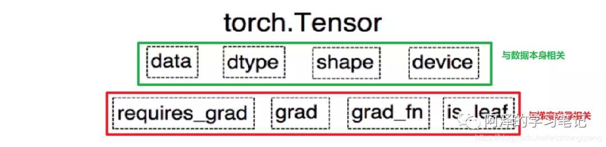

- dtype：张量的数据类型，如 torch.FloatTensor，torch.cuda.FloatTensor，用的最多的一般是 float32 和 int64(torch.long)
- shape：张量的形状，如 (64, 3, 224, 224)
- device：张量所在的设备，GPU/CPU，张量放在 GPU 上才能使用加速。

1. data：被包装的 Tensor；
2. grad：data 的梯度；
3. grad_fn：fn 表示 function 的意思，记录我么创建的创建张量时用到的方法，比如说加法、乘法，这个操作在求导过程需要用到，Tensor 的 Function，是自动求导的关键；
4. requires_grad：指示是否需要梯度，有的不需要梯度；
5. is_leaf：指示是否是叶子节点（张量）；

### 张量中的元素获取

> 类似于numpy，或者python中的list等，通过索引、切片获取张量中的元素，或者改变相应的值。索引出来的结果与原数据共享内存。Pytorch还提供了其他的高级选择函数

#### index_select

- 

> `torch.index_select`(*input*, *dim*, *index*, ***, *out=None*) → [Tensor](https://pytorch.org/docs/stable/tensors.html#torch.Tensor)

```python
x = torch.randn(3, 4)
>>x
tensor([[ 0.1427,  0.0231, -0.5414, -1.0009],
        [-0.4664,  0.2647, -0.1228, -1.1068],
        [-1.1734, -0.6571,  0.7230, -0.6004]])
indices = torch.tensor([0, 2])
>>torch.index_select(x, 0, indices)#dim=0,从行的维度选取
tensor([[ 0.1427,  0.0231, -0.5414, -1.0009],
        [-1.1734, -0.6571,  0.7230, -0.6004]])
>>torch.index_select(x, 1, indices)#dim=1,从列的维度选取
tensor([[ 0.1427, -0.5414],
        [-0.4664, -0.1228],
        [-1.1734,  0.7230]])
```

#### masked_select()

> `torch.masked_select`(*input*, *mask*, ***, *out=None*) → [Tensor](https://pytorch.org/docs/stable/tensors.html#torch.Tensor)

```python
>>> x = torch.randn(3, 4)
>>> x
tensor([[ 0.3552, -2.3825, -0.8297,  0.3477],
        [-1.2035,  1.2252,  0.5002,  0.6248],
        [ 0.1307, -2.0608,  0.1244,  2.0139]])
>>> mask = x.ge(0.5)
>>> mask
tensor([[False, False, False, False],
        [False, True, True, True],
        [False, False, False, True]])
>>> torch.masked_select(x, mask)
tensor([ 1.2252,  0.5002,  0.6248,  2.0139])
```

### 张量数学运算

#### torch.add()

> torch.add(input, alpha=1, other, out=None)
>
> 逐元素计算input+alpha * other,alpha，叫做乘项因子,类似于权重
>
> other可以时候一个矩阵，也可以是一个数

```
y = wx + b
torch.add(b, w, x)
```

#### torch.addcdiv()

> torch.addcdiv(input, value=1, tensor1, tensor2, out=None)

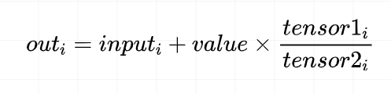

torch.addcmul()

> torch.addcmul(input, value=1, tensor1, tensor2, out=None)

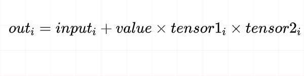

### 自动求导机制

#### torch.autograd.backward()

> `Pytorch` 自动求导机制使用的是 `torch.autograd.backward` 方法，功能就是自动求取梯度。当执行`y.backward()`这个函数时就是调用这个函数。

```python
torch.autograd.backward(tensors, 
grad_tensors=None, 
retain_graph=None,
create_graph=False, 
grad_variables=None, 
inputs=None)
```


- tensors 表示用于求导的张量，如 loss。
- retain_graph 表示保存计算图， 由于 Pytorch 采用了动态图机制，在每一次反向传播结束之后，计算图都会被释放掉。如果我们不想被释放，就要设置这个参数为 True
- create_graph 表示创建导数计算图，用于高阶求导。
- `grad_tensors` 表示多梯度权重。如果有多个 loss 需要计算梯度的时候，就要设置这些 loss 的权重比例。

```python
w=torch.tensor([1.0],requires_grad=True)
x=torch.tensor([2.0],requires_grad=True)
a=torch.add(w,x)
b=torch.add(w,1)
y0=torch.mul(a,b)
y1=torch.add(a,b)
loss=torch.cat([y0,y1],dim=0)
loss.backward()
>>> RuntimeError: grad can be implicitly created only for scalar outputs

grad_tensors = torch.tensor([1., 1.])
loss.backward(gradient=grad_tensors)    
print(w.grad)   #  这时候会是tensor([7.])   5+2

grad_tensors = torch.tensor([1., 2.])
loss.backward(gradient=grad_tensors)    
print(w.grad)   #  这时候会是tensor([9.])   5+2*2  

```

#### torch.autograd.grad()

> 这个方法的功能是求取梯度，这个可以实现高阶的求导。
>
> `torch.autograd`.`grad`(*outputs*, *inputs*, *grad_outputs=None*, *retain_graph=None*, *create_graph=False*, *only_inputs=True*, *allow_unused=False*)

- outputs: 用于求导的张量，如 loss
- inputs: 需要梯度的张量，如上面例子的 w
- create_graph: 创建导数计算图，用于高阶求导
- retain_graph: 保存计算图
- grad_outputs: 多梯度权重

```python
x = torch.tensor([3.], requires_grad=True)
y = torch.pow(x, 2)   # y=x^2

# 一次求导
grad_1 = torch.autograd.grad(y, x, create_graph=True)   
# 这里必须创建导数的计算图， grad_1 = dy/dx = 2x
print(grad_1)   # (tensor([6.], grad_fn=<MulBackward0>),) 这是个元组，二次求导的时候我们需要第一部分

# 二次求导
grad_2 = torch.autograd.grad(grad_1[0], x)    # grad_2 = d(dy/dx) /dx = 2
print(grad_2)  # (tensor([2.]),)
```

> 这个函数还允许对多个自变量求导数：

```python
x1 = torch.tensor(1.0,requires_grad = True) *# x需要被求导*
x2 = torch.tensor(2.0,requires_grad = True)
y1 = x1*x2
y2 = x1+x2
*# 允许同时对多个自变量求导数*
(dy1_dx1,dy1_dx2) = torch.autograd.grad(outputs=y1,inputs = [x1,x2],retain_graph = True)
#dy1_dx1=x2,dy1_dx2=x1
print(dy1_dx1,dy1_dx2)    *# tensor(2.) tensor(1.)*

*# 如果有多个因变量，相当于把多个因变量的梯度结果求和*
#dy12_dx1=dy1_dx1+dy1_dx2=x2+x1
#dy12_dx2=dy2_dx1+dy2_dx2=1+1
(dy12_dx1,dy12_dx2) = torch.autograd.grad(outputs=[y1,y2],inputs = [x1,x2])
print(dy12_dx1,dy12_dx2)    *# tensor(3.) tensor(2.)*
```

`关于 Pytorch 的自动求导系统要注意：`

> 1.梯度不自动清零：就是每一次反向传播，梯度都会叠加上去,需要我们手动清零

```python
w = torch.tensor([1.], requires_grad=True)
x = torch.tensor([2.], requires_grad=True)
for i in range(4):
    a = torch.add(w, x)
    b = torch.add(w, 1)
    y = torch.mul(a, b)

    y.backward()
    print(w.grad)
    
## 结果：
tensor([5.])
tensor([10.])
tensor([15.])
tensor([20.])
```

> 手动清除梯度

```python
w.grad.zero_() #w是要清0的张量
#这里有个'_'，这个代表原位操作
```

`原位操作(in—place)：`这个操作就是在原始内存当中去改变这个数据

```python
a = torch.ones((1,))
print(id(a), a)    # 1407221517192 tensor([1.])

# 我们执行普通的a = a+1操作
a = a + torch.ones((1,))
print(id(a), a)    # 1407509388808 tensor([2.])  
# 会发现上面这两个a并不是同一个内存空间

# 那么执行原位操作呢？
a = torch.ones((1,))
print(id(a), a)    # 2112218352520 tensor([1.])
a += torch.ones((1,))
print(id(a), a)   # 2112218352520 tensor([2.])
```

> 2.叶子节点不可执行 in-place操作

> 3.依赖于叶子节点的节点，requires_grad 默认为 True

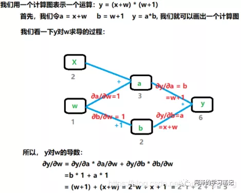

依赖于叶子节点的节点，在上面图中w,x是叶子节点，而依赖于叶子节点的节点，其实这里说的就是 a,b， 也就是 a，b 默认就是需要计算梯度的。这个也好理解，因为计算 w,x 的梯度的时候是需要先对 a, b 进行求导的，要用到 a, b 的梯度，所以这里直接默认 a, b 是需要计算梯度的。

```python
w = torch.tensor([1.], requires_grad=True)
x = torch.tensor([2.], requires_grad=True)
a = torch.add(w, x)
b = torch.add(w, 1)
y = torch.mul(a, b)    # y0=(x+w) * (w+1)     dy0 / dw = 5
print(w.requires_grad, a.requires_grad, b.requires_grad)  
# 这里会都是True， w的我们设置了True， 而后面这里是依赖于叶子，所以默认是True
```

### 常用函数

#### torch.scatter()

> **`scatter()`** 和 **`scatter_()`** 的作用是一样的，只不过 `scatter()` 不会直接修改原来的 Tensor，而 `scatter_()` 会
>
> PyTorch 中，一般函数加**下划线**代表直接在原来的 Tensor 上修改
>
> `scatter(dim, index, src)`用src这个张量或标量修改调用scatter这个函数的张量

- **dim：**沿着哪个维度进行索引
- **index：**用来 scatter 的元素索引
- **src：**用来 scatter 的源元素，可以是一个标量或一个张量

```python
x = torch.rand(2, 5)

#tensor([[0.1940, 0.3340, 0.8184, 0.4269, 0.5945],
#        [0.2078, 0.5978, 0.0074, 0.0943, 0.0266]])

torch.zeros(3, 5).scatter_(0, torch.tensor([[0, 1, 2, 0, 0], [2, 0, 0, 1, 2]]), x)

#tensor([[0.1940, 0.5978, 0.0074, 0.4269, 0.5945],
#        [0.0000, 0.3340, 0.0000, 0.0943, 0.0000],
#        [0.2078, 0.0000, 0.8184, 0.0000, 0.0266]])
```

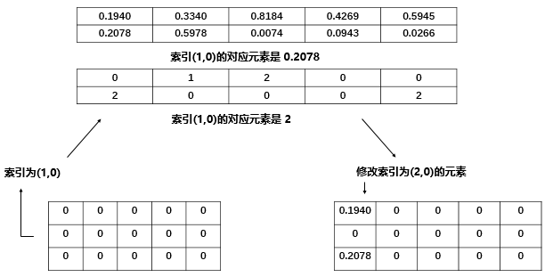

#### torch.squeeze()

> **`「torch.squeeze(input, dim=None, out=None)：`压缩长度为 1 的维度， `dim` 若为 None，移除所有长度为 1 的轴，若指定维度，当且仅当该轴长度为 1 时可以被移除」**

```python
# torch.squeeze
t = torch.rand((1, 2, 3, 1))
t_sq = torch.squeeze(t)
t_0 = torch.squeeze(t, dim=0)
t_1 = torch.squeeze(t, dim=1)
print(t.shape)        # torch.Size([1, 2, 3, 1])
print(t_sq.shape)     # torch.Size([2, 3])
print(t_0.shape)     # torch.Size([2, 3, 1])
print(t_1.shape)     # torch.Size([1, 2, 3, 1])
```

torch.unsqueeze()

> `「torch.unsqueeze(input, dim, out=None)：`依据 dim 扩展维度」

```python
tensor=torch.rand(1,3)
print(tensor)
print(tensor.shape)
tensor.unsqueeze_(dim=1)
print(tensor)
print(tensor.shape)
>>>
tensor([[0.3009, 0.4988, 0.0346]])
torch.Size([1, 3])
tensor([[[0.3009, 0.4988, 0.0346]]])
torch.Size([1, 1, 3])

tensor1=torch.tensor([0, 2, 1, 3])
print(tensor1)
print(tensor1.shape)
tensor1.unsqueeze_(dim=1)
print(tensor)
print(tensor1.shape)
>>>
tensor([0, 2, 1, 3])
torch.Size([4])
tensor([[0],
        [2],
        [1],
        [3]])
torch.Size([4, 1])
```


torch.nn(nn)
---

> import torch.nn as nn

### nn.Module

> 所有网络的基类，自己建立的模型必须要集成这个类.
>
> Module中封装了常用的神经网络层，如卷积层、池化层、RNN等

```

```


### nn.Parameter()


### nn.functional(F)

> import torch.nn.functional as F
>
> nn.functional中定义了大量常用的函数,损失函数等。

#### softmax

> `torch.nn.functional.softmax(input, dim)`,对n维输入张量运用Softmax函数，将张量的每个元素缩放到（0,1）区间且和为1
>
> 常常用在神经网络作为最后的输出

Softmax函数定义如下：

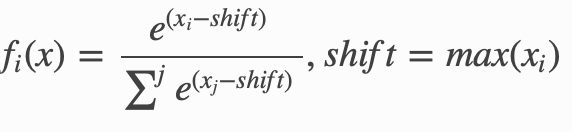

dim:指明维度，dim=0表示按列计算；dim=1表示按行计算。

#### one_hot()

> `torch.nn.functional.one_hot`(*tensor*, *num_classes=- 1*) → LongTensor
>
> 把Tensor转变成one-hot编码

num_classes:特征长度，如果设置为-1，则class的数量将被推断为比输入张量中最大的class值大1

```python
>>> F.one_hot(torch.arange(0, 5) % 3)
tensor([[1, 0, 0],
        [0, 1, 0],
        [0, 0, 1],
        [1, 0, 0],
        [0, 1, 0]])
>>> F.one_hot(torch.arange(0, 5) % 3, num_classes=5)
tensor([[1, 0, 0, 0, 0],
        [0, 1, 0, 0, 0],
        [0, 0, 1, 0, 0],
        [1, 0, 0, 0, 0],
        [0, 1, 0, 0, 0]])
>>> F.one_hot(torch.arange(0, 6).view(3,2) % 3)
tensor([[[1, 0, 0],
         [0, 1, 0]],
        [[0, 0, 1],
         [1, 0, 0]],
        [[0, 1, 0],
         [0, 0, 1]]])
```


### nn.init

> import torch.nn.init as init
>
> nn.init负责网络参数的初始化

torch.optim(optim)
---

> `torch.optim`是一个实现了各种优化算法的库。
>
> `import torch.optim as optim`

### Adma

```python
torch.optim.Adam(params, lr=0.001, betas=(0.9, 0.999), eps=1e-08, weight_decay=0, amsgrad=False)#官网默认值
#真实使用
optimizer = torch.optim.Adam(model.parameters(), lr=0.01, weight_decay=5e-4)
```


数据读取机制
---

### DataLoader()

> torch.utils.data.DataLoader():构建可迭代的数据装载器, 我们在训练的时候，每一个 `for` 循环，每一次 `iteration`(迭代)，就是从 `DataLoader` 中获取一个 `batch_size` 大小的数据的。

```python
DataLoader(dataset, batch_size=1, shuffle=False, sampler=None,
           batch_sampler=None, num_workers=0, collate_fn=None,
           pin_memory=False, drop_last=False, timeout=0,
           worker_init_fn=None, *, prefetch_factor=2,
           persistent_workers=False)
```

DataLoader 的参数很多，但我们常用的主要有 5 个：

- dataset: Dataset 类， 决定数据从哪读取以及如何读取
- bathsize: 批大小
- num_works: 是否多进程读取机制
- shuffle: 每个 epoch 是否乱序
- `drop_last`: 当样本数不能被 batchsize 整除时， 是否舍弃最后一批数据

> Epoch， Iteration 和 Batchsize 的概念

- Epoch：所有训练样本都已输入到模型中，称为一个 Epoch
- Iteration：一批样本输入到模型中，称为一个 Iteration
- Batchsize：批大小，决定一个 Epoch 有多少个 Iteration

### Dataset()

> `torch.utils.data.Dataset()`: Dataset 抽象类， 所有自定义的 Dataset 都需要继承它，并且必须复写 `__getitem__()` 这个类方法。


# numpy

## np.genfromtxt()

> genfromtxt可以分解成两步，第一步是从文件读取数据，并转化成为字符串。第二步就是将字符串转化成为指定的数据类型。

```python
numpy.genfromtxt(fname, 
dtype=<class 'float'>, 
comments='#', 
delimiter=None, skip_header=0, skip_footer=0, converters=None, missing_values=None, filling_values=None, usecols=None, names=None, excludelist=None, deletechars=" !#$%&'()*+, -./:;<=>?@[\]^{|}~", replace_space='_', autostrip=False, case_sensitive=True, defaultfmt='f%i', unpack=None, usemask=False, loose=True, invalid_raise=True, max_rows=None, encoding='bytes')
```

> 最常用是前三个参数只有fname是必须的参数，其他的都是可选的。
>
> fname如果是单独的str，那么默认是本地或者远程文件的名字。如果是list of str，那么每个str都被当做文件中的一行数据。如果传入的是远程的文件，这个文件会被自动下载到本地目录中。
>
> dtype转换的指定数据类型
>
> delimiter是分割符号

genfromtxt还可以自动识别文件是否是压缩类型，目前支持两种压缩类型：gzip 和 bz2。

np.concatenate
---

> np.concatenate((a1,a2,..),axis=0),用于数组拼接。
>
> 默认axis=0,按照行进行拼接（列数不变），axis=1按照列进行拼接（行数不变）

```python
>>> a=np.array([[1,2,3],[4,5,6]])
>>> b=np.array([[11,21,31],[7,8,9]])
>>> np.concatenate((a,b),axis=0)
array([[ 1,  2,  3],
       [ 4,  5,  6],
       [11, 21, 31],
       [ 7,  8,  9]])
```

np.argmax()
---

> np.argmax(a, axis=None, out=None)

- a ：输入一个array类型的数组。
- axis：参数为None时默认比较整个数组，参数为0按列比较，参数为1按行比较。

```python
a=np.array(
[
    [1,8,3],
    [5,7,9],
    [7,4,6],
    [2,3,10]
])
np.argmax(a)#axis=Node,相当于将数组变为一维，输出最大值的index
np.argmax(a,axis=1)#按照行进行比较，'1'表示第一行中'1'列的值最大
np.argmax(a,axis=0)#按照列进行比较，'2'表示第一列中，'2'行的值最大
>>
11
[1 2 0 2]
[2 0 3]
```

np.asarray()
---

> np.asarray(a, dtype=None, order=None),将结构数据转化为ndarray

```python
np.asarray的定义：
def asarray(a, dtype=None, order=None):
    return array(a, dtype, copy=False, order=order)
np.array的定义：
def array(a, dtype=None, order=None):
    return array(a, dtype, copy=True, order=order)
```

主要区别在于 `np.array`（默认情况下）将会copy该对象，而 `np.asarray`除非必要，否则不会copy该对象。

np.power()
---

> ##### np.power(x, y) 函数，计算 x 的 y 次方

```python
np.power(2, 3)
>>8
np.power([2,3,4], 3)
>>[ 8 27 64]
np.power(2, [2,3,4])
>>[ 4 8 16]
np.power([2,3], [3,4])
>>[ 8 81]
a=([[180, 184, 188, 192, 196, 200],
        [204, 208, 212, 216, 220, 224],
        [228, 232, 236, 240, 244, 248],
        [252, 256, 260, 264, 268, 272],
        [276, 280, 284, 288, 292, 296]])
np.power(a, 0.5)
>>array([[13.41640786, 13.56465997, 13.7113092 , 13.85640646, 14.        ,
        14.14213562],
       [14.28285686, 14.4222051 , 14.56021978, 14.69693846, 14.83239697,
        14.96662955],
       [15.09966887, 15.23154621, 15.3622915 , 15.49193338, 15.62049935,
        15.74801575],
       [15.87450787, 16.        , 16.1245155 , 16.24807681, 16.37070554,
        16.4924225 ],
       [16.61324773, 16.73320053, 16.85229955, 16.97056275, 17.08800749,
        17.20465053]])
```

np.flatten()
---

> np.flatten()，该函数返回一个折叠成一维的数组。该函数只能适用于numpy对象

```python
a = np.mat([[1,2,],[2,3],[3,4]])
b=a.flatten()
c=b.A[0]
a,b,c
>>(matrix([[1, 2],
         [2, 3],
         [3, 4]]),
 matrix([[1, 2, 2, 3, 3, 4]]),
 array([1, 2, 2, 3, 3, 4]))
```


pickle
===

pickle.load()
---

> pickle.load(file，encoding)
>
> 反序列化对象，将文件中的数据解析为一个python对象

```python
data = pickle.load(open(save_file, "rb"))
```

pickle.dump()
---

> pickle.dump(obj, file, [,protocol])

- obj：要保存的对象
- file：对象保存到的类文件对象。file必须有write()接口， file可以是一个以’w’方式打开的文件或者一个StringIO对象或者其他任何实现write()接口的对象。如果protocol>=1，文件对象需要是二进制模式打开的。
- protocol：默认是0（ASCII协议，表示以文本的形式进行序列化），protocol的值还可以是1和2（1和2表示以二进制的形式进行序列化。其中，1是老式的二进制协议；2是新二进制协议）

```python
save_file="../data/cora/ch5_cached.pkl"
with open(save_file, "wb") as f:
    pickle.dump(obj, f)
```


scipy
===

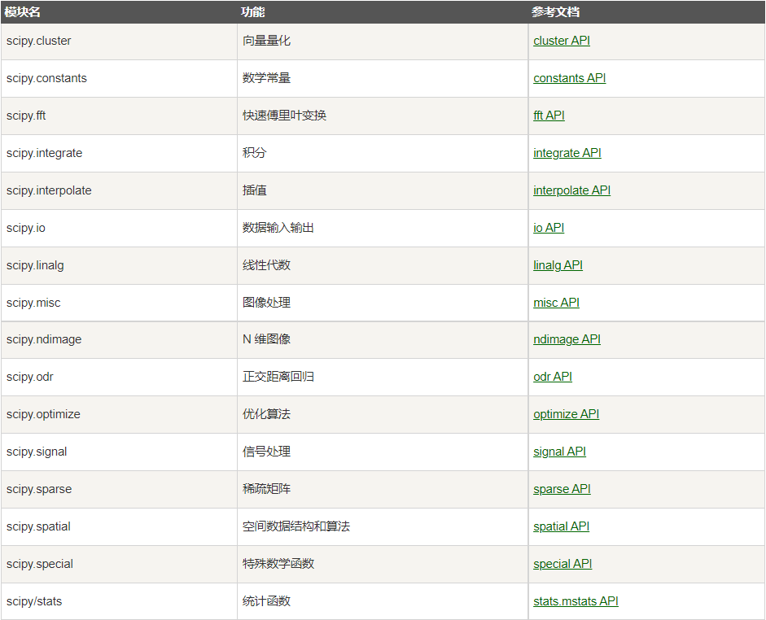

scipy.sparse(sp)
---

> 该模块主要针对稀疏矩阵

[SciPy 模块列表](https://www.runoob.com/scipy/scipy-module.html)

[scipy.sparse的一些方法整理](https://blog.csdn.net/qq_33466771/article/details/80304498)

### sp.coo_matrix()

> coo_matrix((data, (i, j)), [shape=(M, N)])  用于生成系数矩阵

- data[:] 就是原始矩阵中的数据

- i[:] 就是行的指示符号

- j[:] 就是列的指示符号

- shape参数是告诉coo_matrix原始矩阵的形状

  `A[i[k], j[k]] = data[k]`

```python
row  = np.array([0, 3, 1, 0,0])
col  = np.array([0, 3, 1, 2,0])
data = np.array([4, 5, 7, 9])
>>> coo_matrix((data, (row, col)), shape=(4, 4)).toarray()
#4+1在(0,0),5在(3,3),7在(1,1),9在(0,2),其余位置都为0
array([[5, 0, 9, 0],
        [0, 7, 0, 0],
       [0, 0, 0, 0],
        [0, 0, 0, 5]])
```

#### dot()

> dot(other)：与other矩阵的矩阵乘法

```python
A = csr_matrix([[1, 2, 0], [0, 0, 3], [4, 0, 5]])
v = np.array([1, 0, -1])
A.dot(v)#会先将V转置
>>array([ 1, -3, -1], dtype=int64)
```


#### sum()

> coo_matrix.sum(axis=None,dtype=None,out=None)
>
> out为**np.matrix**


#### get_shape()

> get_shape()：返回稀疏矩阵的维度

#### tocoo()

> 返回稀疏矩阵的coo_matrix形式

### sp.diags()

> sp.diags(diagonals, offsets=0, shape=None, format=None, dtype=None)**
>
> 从对角线构造一个稀疏矩阵。

| **diagonals**                                  | **包含矩阵对角线的数组序列，对应于偏移量。**                 |
| ---------------------------------------------- | ------------------------------------------------------------ |
| offsets                                        | **k = 0主对角线（默认）；k> 0第k个对角线 ；k <0第k个较低的对角线** |
| **shape：tuple of int,可选**                   | **结果的形状。 如果省略，则返回足够大以包含对角线的方阵。**  |
| **format{“dia”, “csr”, “csc”, “lil”, …},可选** | **果的矩阵格式。 默认情况下（format=None），返回适当的稀疏矩阵格式。 此选择可能会更改。** |
| **dtype,可选**                                 | **矩阵的数据类型**                                           |

```python
>>> from scipy.sparse import diags
>>> diagonals = [[1, 2, 3, 4], [1, 2, 3], [1, 2]]
>>> diags(diagonals, [0, -1, 2]).toarray()
array([[1, 0, 1, 0],
       [1, 2, 0, 2],
       [0, 2, 3, 0],
       [0, 0, 3, 4]])

>>> diags([1, -2, 1], [-1, 0, 1], shape=(4, 4)).toarray()
array([[-2.,  1.,  0.,  0.],
       [ 1., -2.,  1.,  0.],
       [ 0.,  1., -2.,  1.],
       [ 0.,  0.,  1., -2.]])

>>> diags([1, 2, 3], 1).toarray()
array([[ 0.,  1.,  0.,  0.],
       [ 0.,  0.,  2.,  0.],
       [ 0.,  0.,  0.,  3.],
       [ 0.,  0.,  0.,  0.]])

```

### sp.eye()

> 创建对角线为1单位矩阵
>
> eye(N, M=None, k=0, dtype=float) 

```python
print "--------------3x3 对角为1的矩阵，元素的类型默认为  整型------------------"
print eye(3)
print "--------------3x3 对角为1的float矩阵------------------"
print eye(3,3)
print "--------------3x4 对角为1的矩阵------------------"
print eye(3,4)
print "--------------3x4 对角为1的矩阵------------------"
print eye(3,4,0)
print "--------------3x3 从第二列对角为1的矩阵------------------"
print eye(3,4,1)
print "--------------3x3 从第三列对角为1的矩阵------------------"
print eye(3,4,2)
print "--------------3x3 从第四列对角为1的矩阵------------------"
print eye(3,4,3)
print "--------------3x3 对角为1的矩阵，元素的类型为 int 整型------------------"
print eye(3,3,0,dtype=int)
print "--------------3x3 对角为1的矩阵，元素的类型为 float 整型------------------"
print eye(3,3,0,dtype=float)
```

### sp.identify()

> identity(n[, dtype, format])：创建单位矩阵

# os

os.path(osp)
---

### osp.exists()

> osp.exists(filePath),用于判断filePath这个文件是否存在

```python
osp.exists('aaaa\bbbb\ccccc.txt')
>>True/False
```

### osp.join()

> 用于路径拼接，传入多个路径进行拼接

```python
os.path.join('aaaa','bbbb','ccccc.txt')
>>aaaa\bbbb\ccccc.txt
```

### osp.basename()

> 返回路径最后一个文件名

```python
path='D:\CSDN'
os.path.basename(path)=CSDN   #返回路径最后的文件
```

### osp.abspath()

```python
import os
print(os.path.abspath(".")#当前目录的绝对路径
print(os.path.abspath(r".."))#上级目录的绝对路径
```

collections
===

collections.namedtuple()
---

> 用于生成对象，而且对象拥有可访问的属性

```python
from collections import namedtuple
 # 定义一个namedtuple类型User，并包含name，sex和age属性。
User = namedtuple('User', ['name', 'sex', 'age'])
 # 创建一个User对象
user = User(name='kongxx', sex='male', age=21)
 # 也可以通过一个list来创建一个User对象，这里注意需要使用"_make"方法
user = User._make(['kongxx', 'male', 21])
 print user
# User(name='user1', sex='male', age=21)
 
# 获取用户的属性
print user.name
print user.sex
print user.age
 
# 修改对象属性，注意要使用"_replace"方法
user = user._replace(age=22)
print user
# User(name='user1', sex='male', age=21)
 
# 将User对象转换成字典，注意要使用"_asdict"
print user._asdict()
# OrderedDict([('name', 'kongxx'), ('sex', 'male'), ('age', 22)])
```

collections.defaultdict()
---

> 用于产生一个带有默认值的dict。主要针对key不存在的情况下，也希望有返回值的情况。


operator
===

operator.itemgetter()
---

> itemgetter用来去dict中的key

```python
a = [4, 3, 8]
b = operator.itemgetter(2)
>>b(a)
8
c = operator.itemgetter(2, 1)
>>c(a)
(8,3)
h = [[2, 3], [9, 0], [56, 43]]
o = operator.itemgetter(2, 1)
>>o(h)
([56, 43], [9, 0])
h = [[2, 3], [9, 0], [56, 43]]
o = operator.itemgetter((2, 1))#不可以传入元组作为参数
>>o(h)
TypeError: list indices must be integers or slices, not tuple

#用于排序
a=[('john', 'A', 15), ('jane', 'B', 12), ('dave', 'B', 10)]
#先按照元组中下标为1的值对对象排序，当下标为1的值相同时，再按照下标2来排序
>>>sorted(a, key=operator.itemgetter(1,2)) 
[('john', 'A', 15), ('dave', 'B', 10), ('jane', 'B', 12)]
#从大到小
>>>sorted(a, key=operator.itemgetter(1,2), reverse=True) 
[('jane', 'B', 12), ('dave', 'B', 10), ('john', 'A', 15)]
 #仅仅按照元组中下标为2的值对对象排序，从大到小。
>>> sorted(a, key=operator.itemgetter(2), reverse=True)
[('john', 'A', 15), ('jane', 'B', 12), ('dave', 'B', 10)]
```


itertools
===

itertools.groupby()
---

> 分组函数，用于对数据进行分组处理

```python
from operator import itemgetter #itemgetter用来去dict中的key，省去了使用lambda函数
from itertools import groupby #itertool还包含有其他很多函数，比如将多个list联合起来。。
d1={'name':'zhangsan','age':20,'country':'China'}
d2={'name':'wangwu','age':19,'country':'USA'}
d3={'name':'lisi','age':22,'country':'JP'}
d4={'name':'zhaoliu','age':22,'country':'USA'}
d5={'name':'pengqi','age':22,'country':'USA'}
d6={'name':'lijiu','age':22,'country':'China'}
lst=[d1,d2,d3,d4,d5,d6]
#通过country进行分组：
lst.sort(key=itemgetter('country')) #需要先排序，然后才能groupby。lst排序后自身被改变
lstg = groupby(lst,itemgetter('country')) 
#lstg = groupby(lst,key=lambda x:x['country']) 等同于使用itemgetter()
for key,group in lstg:
    print(key)
    for g in group: #group是一个迭代器，包含了所有的分组列表
        print (key,g)
>>>
China
China {'name': 'zhangsan', 'age': 20, 'country': 'China'}
China {'name': 'lijiu', 'age': 22, 'country': 'China'}
JP
JP {'name': 'lisi', 'age': 22, 'country': 'JP'}
USA
USA {'name': 'wangwu', 'age': 19, 'country': 'USA'}
USA {'name': 'zhaoliu', 'age': 22, 'country': 'USA'}
USA {'name': 'pengqi', 'age': 22, 'country': 'USA'}
```

pandas
===

read_csv()
---

> 读取CSV文件

filepath_or_buffer : 路径 URL 可以是http, ftp, s3, 和 file.

`sep:` 指定分割符，默认是’,’，引擎不能自动检测分隔符，但Python解析引擎可以

`delimiter:` 同sep

delimiter_whitespace: True or False 默认False, 用空格作为分隔符等价于spe=’\s+’如果该参数被调用，则delimite不会起作用

header: 指定第几行作为列名(忽略注解行)，如果没有指定列名，默认header=0; 如果指定了列名header=None

`names 指定列名`，如果文件中不包含header的行，应该显性表示header=None

index_col: 默认为None 用列名作为DataFrame的行标签，如果给出序列，则使用MultiIndex。如果读取某文件,该文件每行末尾都有带分隔符，考虑使用index_col=False使panadas不用第一列作为行的名称。

usecols： 默认None 可以使用列序列也可以使用列名，如 [0, 1, 2] or [‘foo’, ‘bar’, ‘baz’]，选取的列

as_recarray：默认False , 将读入的数据按照numpy array的方式存储，0.19.0版本后使用 pd.read_csv(…).to_records()。 注意，这种方式读入的na数据不是显示na,而是给以个莫名奇妙的值

squeeze: 默认为False, True的情况下返回的类型为Series

prefix:默认为none, 当header =None 或者没有header的时候有效，例如’x’ 列名效果 X0, X1, …

mangle_dupe_cols ：默认为True,重复的列将被指定为’X.0’…’X.N’，而不是’X’…’X’。如果传入False，当列中存在重复名称，则会导致数据被覆盖。

dtype: E.g. {‘a’: np.float64, ‘b’: np.int32} 指定数据类型

engine: {‘c’, ‘python’}, optional 选择读取的引擎目前来说C更快，但是Python的引擎有更多选择的操作

skipinitialspace: 忽略分隔符后的空格,默认false,

skiprows: list-like or integer or callable, default None 忽略某几行或者从开始算起的几行

skipfooter: 从底端算起的几行，不支持C引擎

nrows： int 读取的行数

na_values: 默认None NaN包含哪些情况，默认情况下, ‘#N/A’, ‘#N/A N/A’, ‘#NA’, ‘-1.#IND’, ‘-1.#QNAN’, ‘-NaN’, ‘-nan’, ‘1.#IND’, ‘1.#QNAN’, ‘N/A’, ‘NA’, ‘NULL’, ‘NaN’, ‘n/a’, ‘nan’, ‘null’. 都表现为NAN

keep_default_na: 如果na_values被定义,keep_default_na为False那么默认的NAN会被改写。 默认为True

na_filter: 默认为True, 针对没有NA的文件，使用na_filter=false能够提高读取效率

skip_blank_lines 默认为True,跳过blank lines 而且不是定义为NAN

thousands 千分位符号，默认‘，’

decimal 小数点符号，默认‘.’

encoding: 编码方式

memory_map如果为filepath_or_buffer提供了文件路径，则将文件对象直接映射到内存上，并直接从那里访问数据。使用此选项可以提高性能，因为不再有任何I / O开销。

low_memory 默认为True 在块内部处理文件，导致分析时内存使用量降低，但可能数据类型混乱。要确保没有混合类型设置为False，或者使用dtype参数指定类型。请注意，不管怎样，整个文件都读入单个DataFrame中，请使用chunksize或iterator参数以块形式返回数据。 （仅在C语法分析器中有效）


argparse
===

argparse 是 Python **内置的**一个用于命令项选项与参数解析的模块，通过在程序中定义好我们需要的参数，argparse 将会从 sys.argv 中解析出这些参数，并自动生成帮助和使用信息。

主要有三个步骤：

- 创建 ArgumentParser() 对象
- 调用 add_argument() 方法添加参数
- 使用 parse_args() 解析添加的参数

```python
import argparse
 
parser = argparse.ArgumentParser()

parser.add_argument('--sparse', action='store_true', default=False, help='GAT with sparse version or not.')
parser.add_argument('--seed', type=int, default=72, help='Random seed.')
parser.add_argument('--epochs', type=int, default=10000, help='Number of epochs to train.')
 
args = parser.parse_args()
 
print(args.sparse)
print(args.seed)
print(args.epochs)
 
 
```

add_argument() 参数说明
---

```python
ArgumentParser.add_argument(name or flags...[, action][, nargs][, const][, default][, type][, choices][, required][, help][, metavar][, dest])
```

每个参数解释如下:

- name or flags - 选项字符串的名字或者列表，例如 foo 或者 -f, --foo。
- action - 命令行遇到参数时的动作，默认值是 store。
  - store_const，表示赋值为const；
  - append，将遇到的值存储成列表，也就是如果参数重复则会保存多个值;
  - append_const，将参数规范中定义的一个值保存到一个列表；
- count，存储遇到的次数；此外，也可以继承 argparse.Action 自定义参数解析；
- nargs - 应该读取的命令行参数个数，可以是具体的数字，或者是?号，当不指定值时对于 Positional argument 使用 default，对于 Optional argument 使用 const；或者是 * 号，表示 0 或多个参数；或者是 + 号表示 1 或多个参数。
- const - action 和 nargs 所需要的常量值。
- **default - 不指定参数时的默认值。**
- **type - 命令行参数应该被转换成的类型。**
- choices - 参数可允许的值的一个容器。
- **required - 可选参数是否可以省略 (仅针对可选参数)。**
- help - 参数的帮助信息，当指定为 argparse.SUPPRESS 时表示不显示该参数的帮助信息.
- metavar - 在 usage 说明中的参数名称，对于必选参数默认就是参数名称，对于可选参数默认是全大写的参数名称.
- dest - 解析后的参数名称，默认情况下，对于可选参数选取最长的名称，中划线转换为下划线.

Python方法
===

hasattr()
---

> **hasattr(object, name)** 函数用于判断对象是否包含对应的属性

- object--对象
- name--字符串，属性名

```python
hasattr(out, "toarray")#如果对象有该属性返回 True，否则返回 False
```

extend()
---

> 用于Python中的列表（list）末尾一次性追加另一个序列中的多个值

```python
aList = [123, 'xyz', 'zara', 'abc', 123];
bList = [2009, 'manni'];
aList.extend(bList)
```

enumerate()
---

> enumerate在字典上是枚举、列举z

enumerate参数为可遍历/可迭代的对象(如列表、字符串)

```python
lst = [1,2,3,4,5,6]
for index,value in enumerate(lst):
  print ('%s,%s' % (index,value))
>>>	0,1
    1,2
    2,3
    3,4
    4,5
    5,6
```

切片操作
---

**数组名[首:尾:`步长`,首:尾:`步长`]**


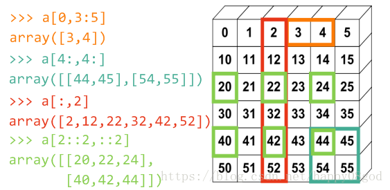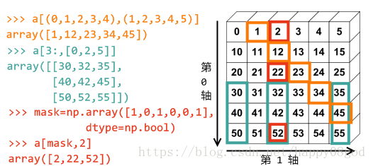

```python
#数组中全部元素
>>> seq[:]                # [seq[0],   seq[1],          ..., seq[-1]    ]
#数组中从下标为low开始往右边的所有元素
>>> seq[low:]             # [seq[low], seq[low+1],      ..., seq[-1]    ]
#数组从开始到下标为high-1左边的所有元素
>>> seq[:high]            # [seq[0],   seq[1],          ..., seq[high-1]]
#数组从下表为low到下标为high-1的所有元素
>>> seq[low:high]         # [seq[low], seq[low+1],      ..., seq[high-1]]
#数组所有元素中每隔stride步长的所有元素
>>> seq[::stride]         # [seq[0],   seq[stride],     ..., seq[-1]    ]
#数组中从下标为low的元素开始每隔stride步长取元素
>>> seq[low::stride]      # [seq[low], seq[low+stride], ..., seq[-1]    ]
#数组中每隔stride步长取元素，到下标为high-1的元素为止
>>> seq[:high:stride]     # [seq[0],   seq[stride],     ..., seq[high-1]]
#数组中从low到high之间每隔stride步长取元素
>>> seq[low:high:stride]  # [seq[low], seq[low+stride], ..., seq[high-1]]
```

**步长为负值**

```python
#数组从最后一个元素开始每隔stride步长取所有元素
>>> seq[::-stride]        # [seq[-1],   seq[-1-stride],   ..., seq[0]    ]
#数组中从下标为high的元素开始向左，每隔stride步长取元素
>>> seq[high::-stride]    # [seq[high], seq[high-stride], ..., seq[0]    ]
#数组从最后一个元素开始每隔stride步长取元素，到下标为low+1的元素为止
>>> seq[:low:-stride]     # [seq[-1],   seq[-1-stride],   ..., seq[low+1]]
#数组从下标为high的元素到下标为low+1的元素每隔stride步长取出
>>> seq[high:low:-stride] # [seq[high], seq[high-stride], ..., seq[low+1]]
```


### 二维数组

> `x[:]`，里面有一个冒号，冒号之前和之后分别表示对象的第`0`个维度(行)和第`1`个维度(列)

x[n,:] =>第n行
x[:,n] =>第n列
x[m:n,:] => m到n-1行
x[:,m:n] => m到n-1列
x[:,-1] => 最后一列
x[-1,:] => 最后一行

```python
import numpy as np
a = np.array([[1, 2, 3, 4], [5, 6, 7, 8], [9, 10, 11, 12], [13, 14, 15, 16], [17, 18, 19, 20]])
print(a.shape)
print(a[0, :], a[0, :].shape)
print(a[1, :], a[1, :].shape)
print(a[-1, :], a[-1, :].shape)
print(a[0:2, :], a[0:2, :].shape)
print(a[:, 0], a[:, 0].shape)
print(a[:, 1], a[:, 1].shape)
print(a[:, -1], a[:, -1].shape)
print(a[:, 0:2], a[:, 0:2].shape)

(5, 4)
[1 2 3 4] (4,)
[5 6 7 8] (4,)
[17 18 19 20] (4,)
[[1 2 3 4]
 [5 6 7 8]] (2, 4)
[ 1  5  9 13 17] (5,)
[ 2  6 10 14 18] (5,)
[ 4  8 12 16 20] (5,)
[[ 1  2]
 [ 5  6]
 [ 9 10]
 [13 14]
 [17 18]] (5, 2)
```

三维数组
---

> `x[::]`，里面有两个冒号，分割出三个间隔，三个间隔的前、中和后分别表示对象的第0、1、2个维度


```python
x[n] = x[n,:,:] = x[n,::] = x[n,...]  => 第0维的第n个元素

x[:,n:]  = x[:,n:,:] 第0维和第2维全选，从第1维开始切片 ≠ x[:,n,:] => 第0维和第2维全选，第1维的n号元素
x[:,n,:] = x[:,n] = x[::,n] = x[::,n,:] ≠ x[:,:,n]
x[m:n,::]  = x[m:n,:,:] => 第0维的第m到n-1个元素
x[:,m:n:]  = x[:,m:n] = x[:,m:n,:] 
x[::,m:n]  = x[::,m:n,:]


x[n,::] => 第0维的第n个元素
x[-1,::] => 第0维的最后一个元素
x[m:n,::] => 第0维的第m到n-1个元素
x[:,n:] => 第1个维度上,n号外的所有元素
```


```python
import numpy as np

b = np.array([[[1, 2, 3, 4], [5, 6, 7, 8], [9, 10, 11, 12]],
              [[13, 14, 15, 16], [17, 18, 19, 20], [21, 22, 23, 24]],
              [[25, 26, 27, 28], [29, 30, 31, 32], [33, 34, 35, 36]],
              ])

print(b.shape)
>>>(3, 3, 4)
print("b[0, ::],b[-1, ::],b[0:2, ::]")
print(b[0, ::], b[0, ::].shape)
>>>
[[ 1  2  3  4]
 [ 5  6  7  8]
 [ 9 10 11 12]] (3, 4)

print(b[-1, ::], b[-1, ::].shape)
>>>
[[25 26 27 28]
 [29 30 31 32]
 [33 34 35 36]] (3, 4)

print(b[0:2, ::], b[0:2, ::].shape)
>>>
[[[ 1  2  3  4]
  [ 5  6  7  8]
  [ 9 10 11 12]],
 [[13 14 15 16]
  [17 18 19 20]
  [21 22 23 24]]] (2, 3, 4)

print("b[:, 1:],b[:, -1:],b[:, 0:2:]")
print(b[:, 1:], b[:, 1:].shape)
>>>
[[ [ 5  6  7  8],[ 9 10 11 12] ],
 [ [17 18 19 20],[21 22 23 24] ],
 [ [29 30 31 32],[33 34 35 36] ] ] (3, 2, 4)

print(b[:, -1:], b[:, -1:].shape)
>>>
[[ [ 9 10 11 12] ],
 [ [21 22 23 24] ],
 [ [33 34 35 36] ] ] (3, 1, 4)

#
print(b[:, 0:2:], b[:, 0:2:].shape)
>>>
[ [ [ 1  2  3  4],[ 5  6  7  8] ],
  [ [13 14 15 16],[17 18 19 20] ],
  [ [25 26 27 28],[29 30 31 32] ] ] (3, 2, 4)


print("b[::, 0],b[::, 1],b[::, -1],b[::, 0:2:]")
print(b[::, 0], b[::, 0].shape)
print(b[::, 1], b[::, 1].shape)
print(b[::, -1], b[::, -1].shape)
print(b[::, 0:2:], b[::, 0:2].shape)
print("b[:,:, 0],b[:,:, 1],b[:,:, -1],b[:,:, 0:2:]")
print(b[:, :, 0], b[:, :, 0].shape)
print(b[:, :, 1], b[:, :, 1].shape)
print(b[:, :, -1], b[:, :, -1].shape)
print(b[:, :, 0:2:], b[:, :, 0:2].shape)
```


PyG框架
===

- torch_geometric:主模块
- torch_geometric.nn：搭建图神经网络层
- torch_geometric.data:图结构数据的表示 
- torch_geometric.loader:加载数据集
- torch_geometric.datasets:常用的图神经网络数据集
- torch_geometric.transforms:数据变换
- torch_geometric.utils:常用工具
- torch_geometric.graphgym:常用的图神经网络模型
- torch_geometric.profile:监督模型的训练

nn
---

data
---

> `PyG`用`torch_geometric.data.Data`保存图结构的数据

下面的data表示自己导入的数据，即Mydata

- data.x：图节点的属性信息，比如社交网络中每个用户是一个节点，这个x可以表示用户的属性信息，维度为[num_nodes,num_node_features]

- data.edge_index:COO格式的图节点连接信息，类型为torch.long,维度为[==2==,num_edges](具体包含两个列表，每个列表对应位置上的数字表示相应节点之间存在边连接）

- data.edge_attr:图中边的属性信息，维度[num_edges,num_edge_features]
- data.y:标签信息，根据具体任务，维度是不一样的，如果是在节点上的分类任务，维度为[==num_edges==,类别数],如果是在整个图上的分类任务，维度为[==1==,类别数]
- data.pos:节点的位置信息（一般用于图结构数据的可视化）

`num_nodes：`图中节点的个数,`num_node_features`图节点特征向量的维度

`num_edges：`图中边的个数,`num_edge_features`图中边特征向量的维度

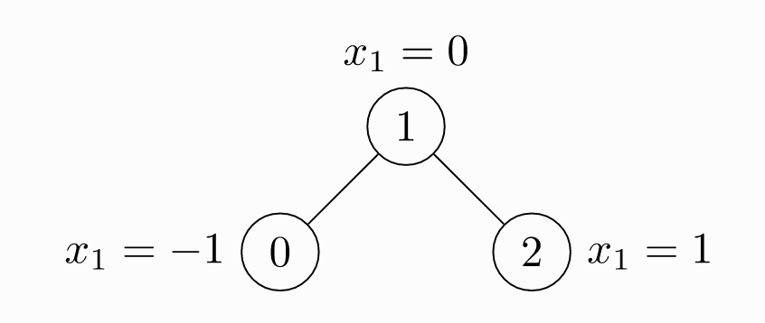

```python
import torch
from torch_geometric.data import Data
# 边的连接信息
# 注意，无向图的边要定义两次
edge_index = torch.tensor(
    [
        # 这里表示节点0和1有连接，因为是无向图
        # 那么1和0也有连接
        # 上下对应着看
        [0, 1, 1, 2],
        [1, 0, 2, 1],
    ],
    # 指定数据类型
    dtype=torch.long
)
# 节点的属性信息
x = torch.tensor(
    [
        # 三个节点
        # 每个节点的属性向量维度为1
        [-1],
        [0],
        [1],
    ]
)
# 实例化为一个图结构的数据
data = Data(x=x, edge_index=edge_index)
print(data)# 查看图数据
>>>
Data(x=[3, 1], edge_index=[2, 4])

print(data.keys)# 图数据中包含什么信息
>>>
['edge_index', 'x']

print(data['x'])# 查看节点的属性信息
>>
tensor([[-1],
        [ 0],
        [ 1]])
print(data.num_nodes)# 节点数数
>>>3
print(data.num_edges)#边数
>>>4
print(data.num_node_features)# 节点属性向量的维度
>>>1
print(data.has_isolated_nodes())# 图中是否有孤立节点
>>>False
print(data.has_self_loops())# 图中是否有环
>>>False
print(data.is_directed())# 是否是有向图
>>>False
```

datasets
---

> datasets中有很多数据集

```python
from torch_geometric.datasets import TUDataset
# 导入数据集
dataset = TUDataset(
    # 指定数据集的存储位置
    # 如果指定位置没有相应的数据集
    # PyG会自动下载
    root='../data/ENZYMES',
    # 要使用的数据集
    name='ENZYMES',
)
# 数据集的长度
print(len(dataset))#有600个图
>>> ENZYMES(600)
# 数据集的类别数
print(dataset.num_classes)#600个图总共分为6类
>>>6
# 数据集中节点属性向量的维度
print(dataset.num_node_features)
>>>6
# 600个图，我们可以根据索引选择要使用哪个图
data = dataset[0]
print(data)
>>>Data(edge_index=[2, 168], x=[37, 3], y=[1])
# 随机打乱数据集
dataset = dataset.shuffle()
#等价于
perm = torch.randperm(len(dataset))
dataset = dataset[perm]
#划分数据集，按照90/10划分训练集和测试集
train_dataset = dataset[:540]
>>> ENZYMES(540)
test_dataset = dataset[540:]
>>> ENZYMES(60)
```

loader
---

> 加载数据集，真正的图神经网络训练中我们一般是加载数据集中的一部分到内存中训练图神经网络，叫做一个batch,那么PyG如何加载一个batch呢，PyG会根据我们的数据集将其分割为我们指定的batch大小

Mini-batches操作

PyG通过创建一个稀疏的块对角矩阵来实现并行化操作，并在节点的维度将节点特征矩阵和target矩阵连接起来。这种方式使得比较容易地在不同的batch中进行操作

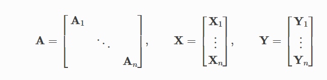

```python
from torch_geometric.loader import DataLoader
from torch_geometric.datasets import TUDataset
# 数据集
dataset = TUDataset(
    root='../data/ENZYMES',
    name='ENZYMES',
    use_node_attr=True,
)
# 建立数据集加载器
# 每次加载32个数据到内存中
loader = DataLoader(
    # 要加载的数据集
    dataset=dataset,
    # ENZYMES包含600个图
    # 每次加载32个
    batch_size=32,
    # 每次加入进来之后是否随机打乱数据（可以增加模型的泛化性）
    shuffle=True
)
for batch in loader:
    print(batch)
    >>>DataBatch(batch=[1082], edge_index=[2, 4066], x=[1082, 21], y=[32])
    print(batch.num_graphs)
    >>>32
```

其中关于batch说明如下：

- `edge_index`：连接的边
- `x`：整个batch的节点特征矩阵
- `y`：graph标签
- `batch`：列向量，用于指示每个节点属于batch中的第几个graph

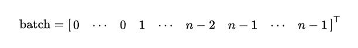

> 我们可以用这个向量实现对每个graph的节点特征求平均

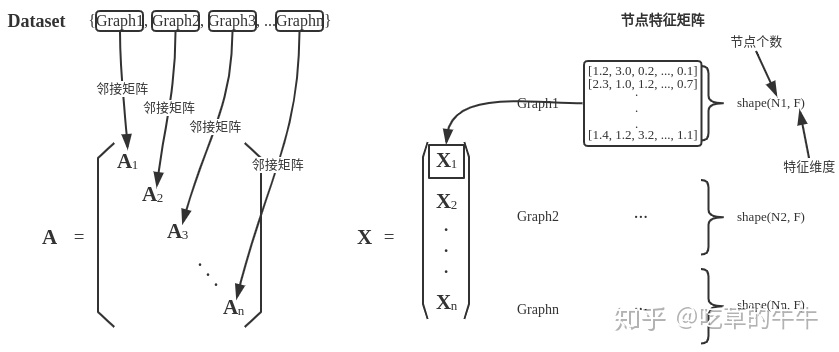


 ![[公式]](https://www.zhihu.com/equation?tex=%5Cmathbf%7BA%7D)矩阵的对角线上每一个矩阵块分别是对应graph的邻接矩阵，X矩阵中的每一个矩阵块，分别是对应graph的节点特征矩阵，然后叠加起来。由于第i个graph的邻接矩阵大小为$(N_i,N_i)$所以， ![[公式]](https://www.zhihu.com/equation?tex=%5Cmathbf%7BA%7D) 矩阵的行数和列数都是$\sum_{i=1}^{n}N_i$ ，其中，$N_i$表示第$i$个graph的节点个数。

```python
from torch_scatter import scatter_mean
from torch_geometric.datasets import TUDataset
from torch_geometric.loader import DataLoader

dataset = TUDataset(root='/tmp/ENZYMES', name='ENZYMES', use_node_attr=True)
loader = DataLoader(dataset, batch_size=32, shuffle=True)

for data in loader:
    data
    >>> DataBatch(batch=[1082], edge_index=[2, 4066], x=[1082, 21], y=[32])

    data.num_graphs
    >>> 32

    x = scatter_mean(data.x, data.batch, dim=0)#对每个graph的节点特征求平均
    x.size()
    >>> torch.Size([32, 21])#[1082,21]=>[32,21]
```

> 这种mini-batch的操作本质上来说是将一个batch的graph看成是一个大的graph，由此，无论batch size是多少，其将所有的操作都统一在一个大图上进行操作。

transforms
---


PyG框架实现GCN
---

> 导入包和数据

```python
import torch
from torch_geometric.datasets import Planetoid
dataset=Planetoid(
   # 数据保存的路径
    # 如果指定目录下不存在数据集
    # PyG会自己进行下载
    root='../data/Cora',
    # 要使用的数据集
    name='Cora',)
```

> 构建模型

```python
import torch.nn as nn
import torch.nn.functional as F
from torch_geometric.nn import GCNConv 
class GCN(nn.Module):
    def __init__(self,input_features,num_class):
        """
            input_feature: 每个节点属性的维度
            num_class: 节点所属的类别数
        """
        super(GCN,self).__init__()
        """
        在这里进行初始化赋值,定义模型的层
        """
        self.input_features=input_features
        self.num_class=num_class
        self.conv1=GCNConv(input_features,32)
        self.conv2=GCNConv(32,num_class)
        self.dropout = nn.Dropout(p=0.5)#nn中的dropout层
    #前向传递
    def forward(self,data):
        """
        data是输入网络中的训练数据
        """
        x,edge_index=data.x,data.edge_index
        x=self.conv1(x,edge_index)
        x=F.relu(x)#用relu函数激活
        """
        使用nn.functional中的dropout层，只需要这一行
        x = F.dropout(x, training=self.training)
        """
        x=self.dropout(x)#nn中的dropout层
        x=self.conv2(x,edge_index)
        out=F.softmax(x,dim=1)
        return out
```

> 初始化网络

```python
input_features=dataset.num_node_features
num_class=dataset.num_classes
GCNNet=GCN(input_features,num_class)
```

> 网络训练

```python
#第一步选择设备
device=torch.device('cuda' if torch.cuda.is_available() else 'cpu' )
#第二步将模型和训练数据放到设备上
model=GCNNet.to(device)
data=dataset[0].to(device)#dataset[0]是一个Data类
#第三步设置优化器
optimizer=torch.optim.Adam(model.parameters(),lr=0.01,weight_decay=5e-4)

train_loss_all=[]#记录训练集损失值
valz_loss_all=[]#记录验证集损失值

#第四步开始训练
model.train()
for epoch in range(200):
    print('当前训练轮次:', epoch)
    #梯度清0
    optimizer.zero_grad()
    
    # 获取模型对于数据的类别预测
    out=model(data)
    
    #计算训练集损失
    loss=F.cross_entropy(out[data.train_mask],data.y[data.train_mask])
    #loss是一个tensor,不是一个数值
    
    #反向传播
    loss.backward()
    optimizer.step()#优化器优化
    train_loss_all.append(loss.cpu().item())#将tensor的loss转变成数值
    
    #计算验证集损失
    loss=F.cross_entropy(out[data.val_mask],data.y[data.val_mask])
    valz_loss_all.append(loss.cpu().item())
    
    print('Epoch:{},tarin_loss:{},val_loss:{}'.format(epoch,train_loss_all[-1],valz_loss_all[-1]))
```

> 在测试集上评估模型

```python
#第五步在测试集上评估模型
model.eval()
_,pred=model(data).max(dim=1)
"""
_:tensor([0.9986, 1.0000, 0.9992,  ..., 0.4520, 0.9963, 0.9941]
pred：tensor([3, 4, 4,  ..., 1, 3, 3]
将对应节点的行特征向量转换为对应的预测标签
如节点对应的行特征向量为
[2.4415e-04, 9.9933e-01, 1.2170e-04, 1.8705e-05, 7.3066e-05, 1.3883e-04,7.1236e-05]
对应的预测标签为'1',因为1位置对应的值最大
"""
print(_,pred)
correct=float(pred[data.test_mask].eq(data.y[data.test_mask]).sum().item())
acc=correct/data.test_mask.sum().item()
print('Accuracy:{:.4f}'.format(acc))
```


模型示例
===

> 机器学习模型训练的步骤


1. 数据模块（数据采集，清洗，处理等）
2. 建立模型（各种模型的建立）
3. 损失函数的选择（根据不同的任务选择不同的损失函数），有了loss就可以求取梯度
4. 得到梯度之后，我们会选择某种优化方式去进行优化
5. 然后迭代训练

线性模型
---

> 第一步：构建线性回归的参数
>
> 第二步：设置训练的次数，何时退出模型

假设求解y = W × x + b

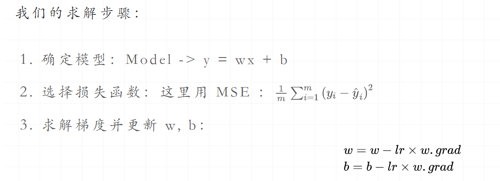

```python
# 首先我们得有训练样本X，Y， 这里我们随机生成
x = torch.rand(20, 1) * 10
y = 2 * x + (5 + torch.randn(20, 1))
lr=0.02			#学习率
# 构建线性回归函数的参数
w = torch.randn((1), requires_grad=True)
b = torch.zeros((1), requires_grad=True)   # 这俩都需要求梯度

for iteration in range(20000):
 # 前向传播
    wx = torch.mul(w, x)
    y_pred = torch.add(wx, b)
 # 计算loss
    loss = (0.5 * (y-y_pred)**2).mean()
    if loss<0.5 :
        break       
 # 反向传播
    loss.backward()
 # 更新参数
    b.data.sub_(lr * b.grad)    # 这种_的加法操作时从自身减，相当于-=
    w.data.sub_(lr * w.grad)
 # 梯度清零
    w.grad.data.zero_()
    b.grad.data.zero_()

print(w.data, b.data)
print(loss)
```

逻辑回归模型
---

> 逻辑回归模型是**「线性」**的**「二分类」**模型，模型的表达式如下：

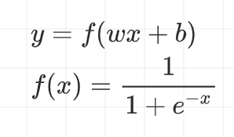

f(x)为sigmoid函数

> 关于线性和非线性模型的区别

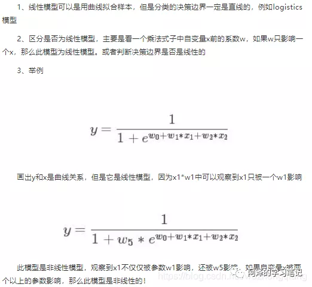


常用代码块
===

将整数标签转为one-hot编码
---

```python
# pytorch的标记默认从0开始
tensor = torch.tensor([0, 2, 1, 3])
N = tensor.size(0)#获得标签的个数(行)
num_classes = 4 #获得一个one-not标签的维度(列数)
one_hot = torch.zeros(N, num_classes).long()
one_hot.scatter_(dim=1, 
                 index=torch.unsqueeze(tensor, dim=1), 
                 src=torch.ones(N, num_classes).long())
```

自定义loss
---

```python
class MyLoss(torch.nn.Moudle):
    def __init__(self):
        super(MyLoss, self).__init__()
        
    def forward(self, x, y):
        loss = torch.mean((x - y) ** 2)
        return loss
```

